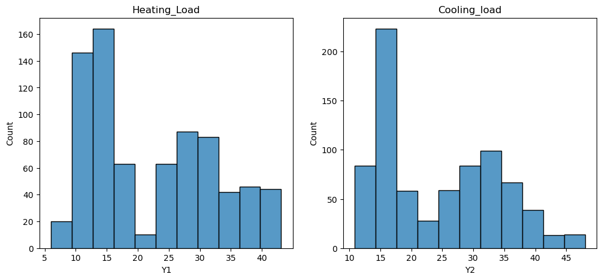
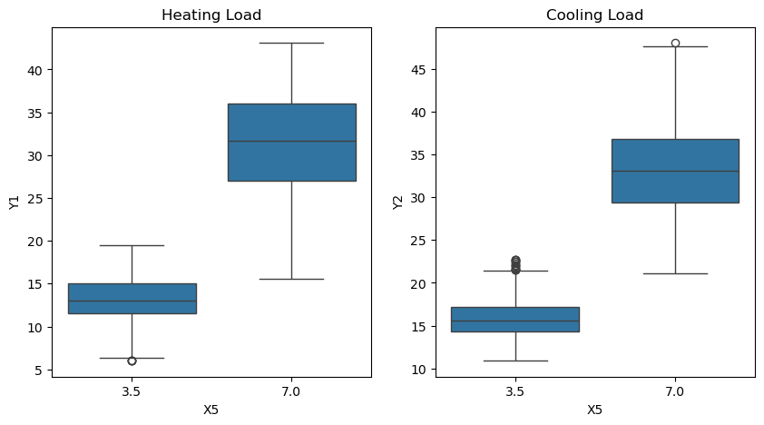
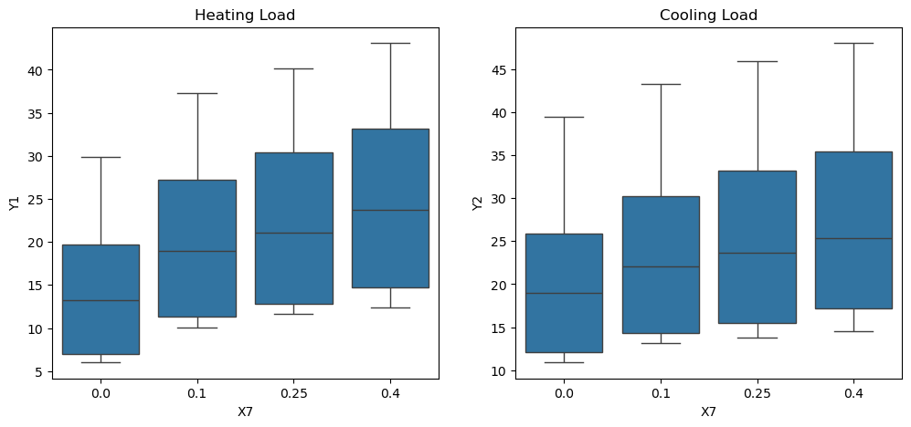
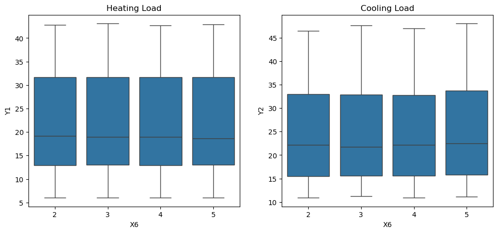
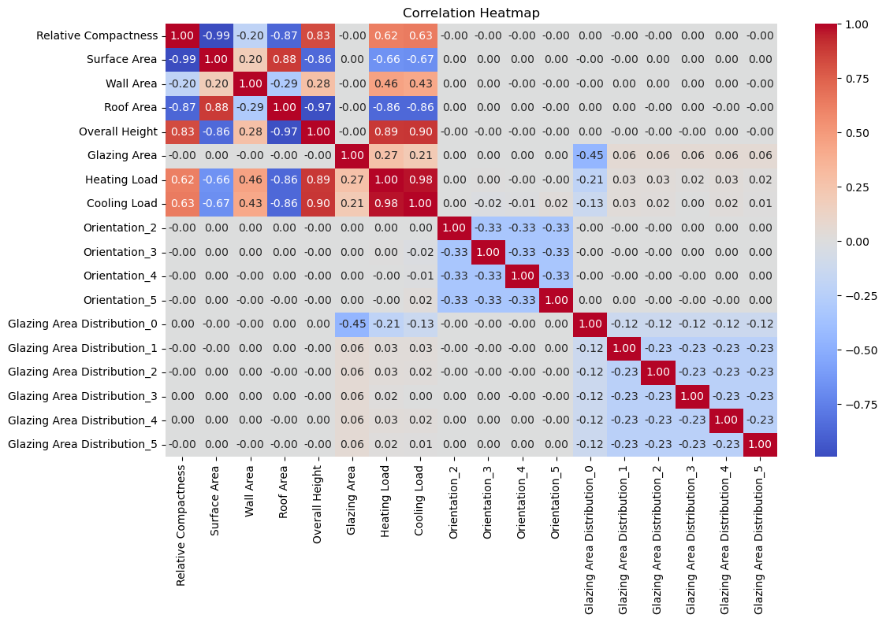
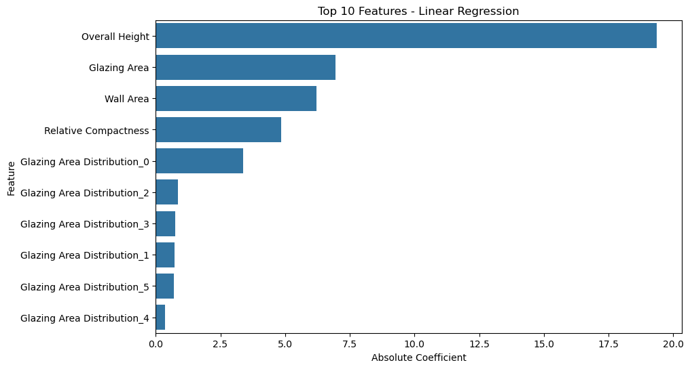
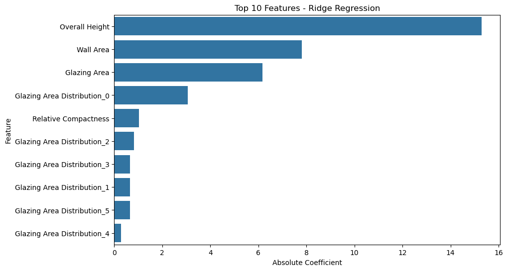
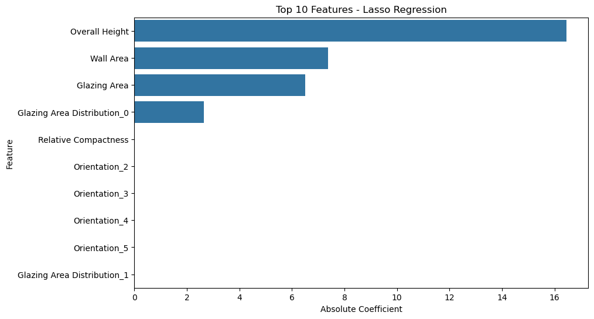

# Energy Efficiency Modeling

Energy performance estimation is a vital component of sustainable architectural design, and having accurate load predicitions is key to building efficiency. If heating and cooling loads are overestimated, construction and operational costs increase unnecessarily, and if they are underestimated, energy conservation goals and occupatn comfort are compromised. 
---

# Intro

This project focuses on analyzing the relationship between physical building characterstics and energy loads (Heating Load and Cooling Load). The dataset comprises 768 building samples with 8 physcial features collected. The data was originally introduced by Angeliki Xifara. 
---

# Project Overview

This project aimed to explore which physcial building characterstics most strongly predict energy efficiency. The project proceeded through four main phases which include the following: 
- Exploration
- Data Cleaning 
- Data Wrangling 
- Data Modeling

---
# Exploration

I begun the exploration phase by generating histograms and boxplots to visualize the distribution of Heating Load and Cooling Load across different building features. 

**Heating Load and Cooling Load Distribution**

**Boxplot: Overall Height vs Energy Loads**

**Boxplot: Glazing Area vs Energy Loads**

**Boxplot: Orientation vs Energy Loads**

---

# Data Cleaning 
The dataset was already very well structured with no missing value or duplicated. Regardless of this there were still some steps taken during the cleaning process such as the following: 
- Renaming columns from X1 - X8, Y1, Y2 to descriptive names
- Converting Orientation and Glazing Area Distribution to category types
- Confirmed no outliers or data entry errors 
---

# Data Wrangling

The following pre processing steps were applied to prepare the data for modeling: 
- One-hot encoded Orientation and Glazing Area Distribution 
- Dropped multicollinear features such as Roof Area and Surface Area based on correlation heatmap findings. 
- Scaled featured using MinMaxScaler
- Split data into 80/20 train/test sets 

**Correlation Heatmap**

---

# Linear Regression Model
Three regression models were built to predict both Heating Load and Cooling Load simultaneously. 

**Linear Regression**
- Mean Squared Error: 9.31
- R-squared: 0.90

**Ridge Regression**
- Penalized large coefficients to address multicollinearity
- Produced more balanced feature importance

**Lasso Regression** 
- Zeroes out Orientation and most Glazing Area Distribution features
- Confirmed these features have little predictive value

**Linear Regression** 

**Ridge Regression** 

**Lasso Regression** 

--- 

# Conclusion
- Overall Height was by far the strongest predictor of both Heating and Cooling Load
- Glazing Area and Wall Area were the next most important features 
- Orinetation had virtuall no effect on energy efficiency 
- All three models achieved consistent results, with Linear Regression reaching an R2 of 0.90 

---
# Next Steps 
- Exploring Additional Models: Trying Random Forest or Gradient Boosting for potentially higher accuracy 
- Classification task: Bin energy loads into low/medium/high categories and build a classifier 
- Additional: Investigating the impact of building age or material type on energy efficiency 